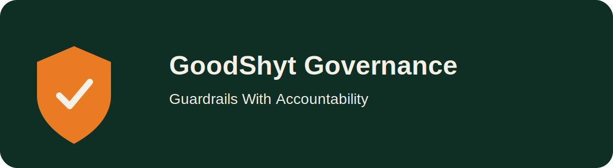

# GoodShyt Governance



Ethical validation, policy enforcement, guardrails, and transparency auditing for accountable intelligent systems.

## Brand line
**Guardrails With Accountability**

## Features
- policy rule engine
- audit report generation
- threshold-based risk assessment
- content flagging for manipulation, opacity, and harm
- FastAPI service for runtime evaluations

## Quickstart
```bash
pip install -e .[dev]
uvicorn goodshyt_governance.api:app --reload
```

## Visual assets
- `assets/logos/primary.svg`
- `assets/logos/mark-dark.svg`
- `assets/covers/repo-cover.svg`

**Architected by Deonte Watts**  
**GoodShyt Group**  
*Ethical Infrastructure for Human and Community Flourishing*
